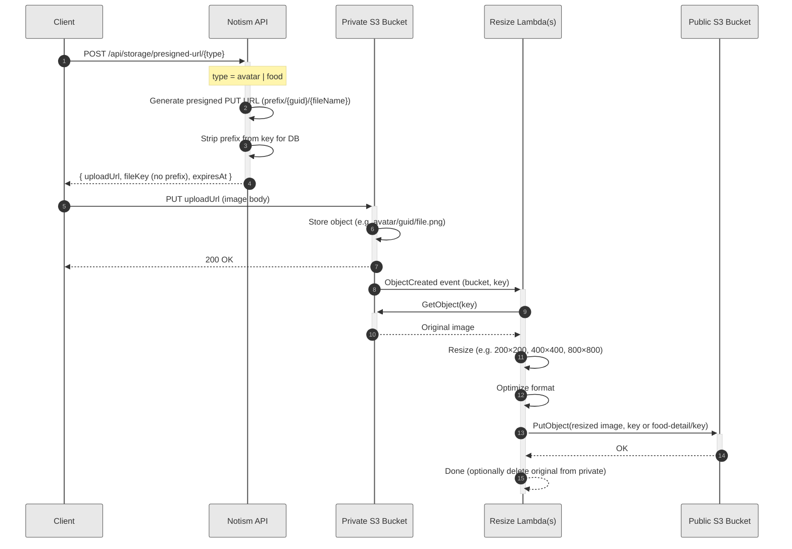
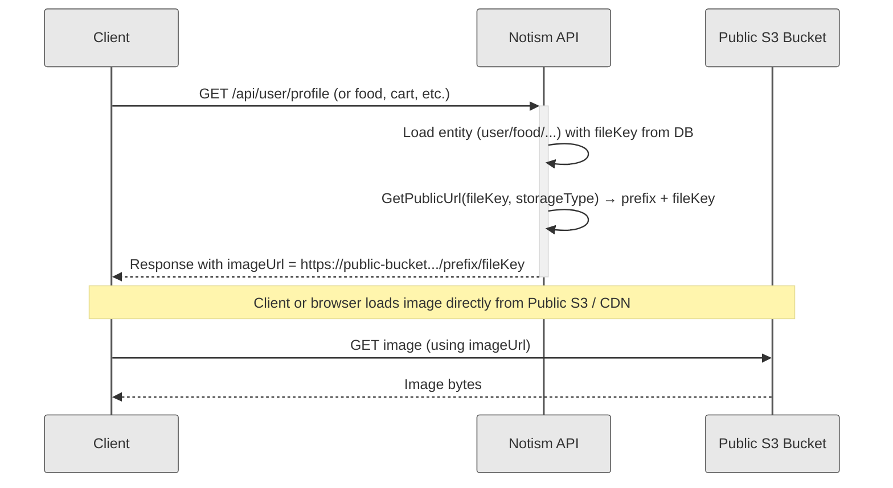

# Image Resizing Flow with AWS S3 and Lambda

## Overview

This document describes the image resizing workflow that uses AWS S3 with two buckets (private and public) and AWS Lambda to automatically resize images. Images are uploaded to the private bucket first, then processed by Lambda and stored in the public bucket.

## Architecture

```
Client → API → Presigned URL → Private S3 Bucket → S3 Event → Lambda → Public S3 Bucket
```

## Components

### 1. S3 Buckets

#### Private Bucket
- **Purpose**: Receives original image uploads from clients
- **Access**: Private, requires presigned URLs for upload/download
- **Configuration**: Defined in `AwsSettings.PrivateBucketName`
- **Lifecycle**: Original images can be retained or deleted after processing

#### Public Bucket
- **Purpose**: Stores resized/processed images for public access
- **Access**: Public read access (via CloudFront CDN recommended)
- **Configuration**: Defined in `AwsSettings.PublicBucketName`
- **URL Format**: `https://{PublicBucketName}.s3.{Region}.amazonaws.com/{fileKey}`

### 2. AWS Lambda Functions

There are three resizing functions, each triggered by S3 `ObjectCreated` on the private bucket with different prefixes. All three use the same IAM execution role: **notism-image-resizing-role**.

| Function | S3 prefix | Dimensions | Destination folder (public bucket) |
|----------|-----------|------------|-------------------------------------|
| **notism-avatar-resizing** | `avatar/` | 200×200 | `avatar/` (same key) |
| **notism-food-resizing** | `food/` | 400×400 | `food/` (same key) |
| **notism-food-detail-resizing** | `food/` | 800×800 | `food-detail/` (path under `food/` becomes path under `food-detail/`) |

Food and food-detail share the same upload path: clients upload only to the **food** folder; both Lambdas are triggered and produce the 400×400 (food) and 800×800 (food-detail) variants in the public bucket.

#### Trigger
- **Event Source**: S3 ObjectCreated event on private bucket
- **Event Types**: `s3:ObjectCreated:*` (PUT, POST, CompleteMultipartUpload)
- **Filter**: By prefix (e.g. `avatar/`, `food/`); typically only image files (`.jpg`, `.jpeg`, `.png`, `.webp`) are uploaded

#### Processing Steps (per Lambda)
1. Receive S3 event notification
2. Download original image from private bucket
3. Resize image to configured dimensions (from env: `RESIZE_WIDTH`, `RESIZE_HEIGHT`)
4. Preserve or convert format (PNG, WebP, JPEG)
5. Upload resized image to public bucket (key = same as source, or with `DESTINATION_PREFIX` for food-detail)
6. Optionally delete original from private bucket (if configured)

### 3. API Integration

#### Upload Flow
1. Client requests presigned URL from API
2. API generates presigned PUT URL for private bucket
3. Client uploads image directly to private bucket using presigned URL
4. S3 triggers Lambda function on successful upload
5. Lambda processes and uploads to public bucket
6. Client can retrieve public URL from API (after processing completes)

## Detailed Flow

### Upload and resize sequence



**Notes:**

- **Step 1–3**: Presigned URL is time-limited. The API returns a `fileKey` without the folder prefix so the client stores only that value (e.g. `{guid}/{fileName}`) in the database.
- **Step 4–5**: Upload is direct from client to S3; the API is not in the path for the binary upload.
- **Step 6–11**: S3 invokes Lambda asynchronously by prefix (`avatar/`, `food/`). For `food/`, both the 400×400 (food) and 800×800 (food-detail) Lambdas can be triggered; each uploads to the public bucket with the appropriate key.

### Retrieve public URL sequence

When the client or a user needs to display an image, the API builds the public URL using the stored file key and the storage type (prefix from constants).



#### File keys and prefixes (reference)

- **Database**: File keys are stored **without** the folder prefix (e.g. `{guid}/{fileName}`). The API strips the prefix when returning the key from the presigned-upload response.
- **Public URLs**: The API prepends the prefix per image type using `StorageTypeConstants` (`avatar`, `food`, `food-detail`).
- **List (food listing/cards)**: `GetPublicUrl(fileKey, "food")` → 400×400 image.
- **Detail (single food page)**: `GetPublicUrl(fileKey, "food-detail")` → 800×800 image.
- **Avatar**: `GetPublicUrl(avatarFileKey, "avatar")` (profile API; falls back when the stored value is already a full URL).
- **Delete**: `DELETE /api/storage/file?fileKey=...&type=avatar|food` — the API prepends the prefix to resolve the S3 key in the private bucket.