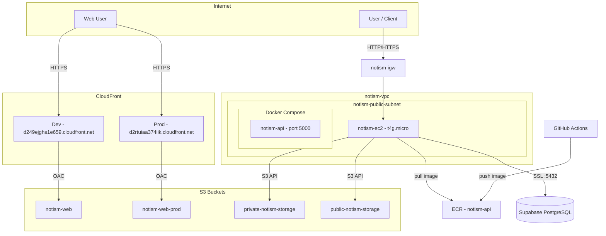
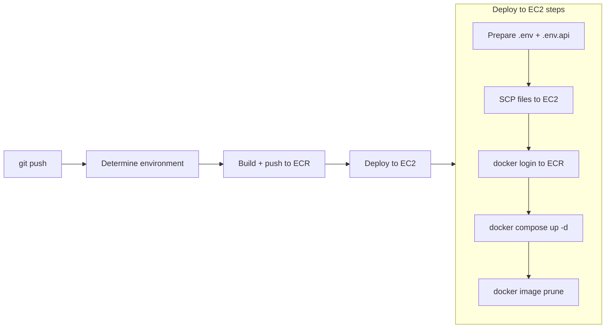

# Notism AWS infrastructure architecture

This document describes the AWS architecture used to run the Notism API. The API runs as a Docker container on a single EC2 instance managed by Docker Compose. PostgreSQL is hosted on Supabase. All AWS resources use the **notism** prefix and are provisioned via Terraform (`terraform/`).

---

## High-level diagram



---

## Components

| Layer | Component | Name / ID | Purpose |
|-------|-----------|-----------|---------|
| **Network** | VPC | notism-vpc | Isolated network (10.0.0.0/16). |
| | Internet Gateway | notism-igw | Connects VPC to the internet; used by the public subnet. |
| | Public subnet | notism-public-subnet | Hosts EC2; has route to IGW (0.0.0.0/0). AZ: us-east-1a. |
| | Public route table | notism-public-rt | 0.0.0.0/0 -> IGW; ::/0 -> IGW (IPv6); associated with public subnet. |
| **Compute** | EC2 | notism-api (Name tag) | Runs Docker Compose with the API container; t4g.micro, Amazon Linux 2023. |
| | Elastic IP | notism-api-eip | Stable public IP for the API. |
| **Database** | PostgreSQL (Supabase) | db.vqwfgdsazmalixzmvfok.supabase.co | Managed PostgreSQL 17 hosted on Supabase. Connection string stored in `CONNECTION_STRING` GitHub secret. |
| **Security** | EC2 security group | notism-ec2-sg | Inbound: 22, 80, 443. Outbound: all. |
| **IAM** | Instance profile | notism-ec2-profile | Attached to EC2; allows S3 and ECR pull. |
| | Role | notism-ec2-role | Assumed by EC2; no long-lived keys in app config. |
| **Container registry** | ECR repository | notism-api | Stores Docker image for the API; CI pushes, EC2 pulls. |
| **Storage** | S3 bucket | private-notism-storage | Private file storage for the API (CORS, referer-based policy). |
| | S3 bucket | public-notism-storage | Public file storage (public-read policy). |
| | S3 bucket | notism-web | Dev frontend static hosting (served via CloudFront). |
| | S3 bucket | notism-web-prod | Prod frontend static hosting (served via CloudFront). |
| **CDN** | CloudFront distribution | E1GJTPGEDUM3ZO | Dev frontend CDN (origin: notism-web, OAC). |
| | CloudFront distribution | E3B3TRUPIAA1TW | Prod frontend CDN (origin: notism-web-prod, OAC). |
| | Origin Access Control | oac-notism-web | Allows CloudFront to read from notism-web bucket. |
| | Origin Access Control | oac-notism-web-prod | Allows CloudFront to read from notism-web-prod bucket. |

---

## Docker Compose deployment

The API runs as a single container managed by Docker Compose on the EC2 instance. PostgreSQL is external (Supabase) — no database container on EC2.

### File layout on EC2

```
/opt/notism/
  docker-compose.yml   # service definition (api only)
  .env                 # compose-level variables (API_IMAGE)
  .env.api             # API app config (connection string, JWT, etc.)
```

### Services

| Service | Image | Container name | Purpose |
|---------|-------|---------------|---------|
| `api` | ECR image (variable `${API_IMAGE}`) | `notism-api` | .NET 9 API. Reads config from `.env.api`. Connects to Supabase via `CONNECTION_STRING`. |

### Connection string

The API connects to Supabase PostgreSQL using SSL:

```
Host=db.vqwfgdsazmalixzmvfok.supabase.co;Database=postgres;Username=postgres;Password=<from CONNECTION_STRING secret>;Port=5432;SSL Mode=Require;Trust Server Certificate=true
```

### Useful commands (on the EC2)

```bash
cd /opt/notism

sudo docker compose ps              # container status
sudo docker compose logs -f api     # follow API logs
sudo docker compose restart api     # restart the API
sudo docker compose down            # stop everything
sudo docker compose up -d           # start everything
```

---

## CI/CD pipeline

Deployment is triggered by pushes to `main` or `dev` via `.github/workflows/deploy.yml`.



### GitHub secrets and variables

| Name | Type | Purpose |
|------|------|---------|
| `AWS_ROLE_TO_ASSUME` | Secret | IAM role ARN for OIDC authentication. |
| `CONNECTION_STRING` | Secret | Npgsql connection string for Supabase PostgreSQL. |
| `JWT_SECRET` | Secret | JWT signing key. |
| `MAILERSEND_API_KEY` | Secret | MailerSend email API key. |
| `EC2_HOST` | Secret | EC2 public IP (Elastic IP). |
| `EC2_USER` | Secret | SSH user (typically `ec2-user`). |
| `EC2_SSH_PRIVATE_KEY` | Secret | PEM private key for SSH access. |
| `ECR_REPOSITORY` | Secret | ECR repository name (`notism-api`). |
| `AWS_ACCESS_KEY` | Secret | AWS access key for S3 operations from the API. |
| `AWS_SECRET_KEY` | Secret | AWS secret key for S3 operations from the API. |
| `GOOGLE_OAUTH_CLIENT_ID` | Secret | Google OAuth client ID. |
| `GOOGLE_OAUTH_CLIENT_SECRET` | Secret | Google OAuth client secret. |
| `AWS_REGION` | Variable | AWS region (`us-east-1`). |

---

## Network design

### VPC and CIDR

- One VPC (10.0.0.0/16) with an IPv6 CIDR block (`2600:1f18:61e2:3000::/56`) assigned.
- Public subnet: 10.0.1.0/24 (IPv6: `2600:1f18:61e2:3000::/64`).

### Public subnet

The public subnet has routes `0.0.0.0/0` and `::/0` to the Internet Gateway. EC2 gets a public IPv4 (Elastic IP) and an IPv6 address. IPv6 is required for direct connections to Supabase, which exposes its database endpoint on IPv6 only.

### Route tables

- **notism-public-rt**: IPv4 `0.0.0.0/0` and IPv6 `::/0` → notism-igw; associated with notism-public-subnet.

---

## Security

### Security groups

- **notism-ec2-sg**: Allows SSH (22), HTTP (80), and HTTPS (443) from `0.0.0.0/0`. In production, restrict SSH to known IPs.

### IAM

- EC2 uses the **notism-ec2-profile** instance profile (role **notism-ec2-role**).
- The role has Amazon S3 full access and Amazon ECR read-only access so the app can use S3 buckets and pull images without storing access keys.

### Secrets

- Database connection string is stored in the `CONNECTION_STRING` GitHub secret and written to `.env.api` on EC2 at deploy time.
- All app secrets (JWT, MailerSend, OAuth) are written to `.env.api` at deploy time. They never appear in the repo or Docker image.

---

## Data flow

1. **User -> API**: Internet -> IGW -> notism-public-subnet -> EC2 (port 80/443 via Caddy) -> notism-api container.
2. **User -> Frontend**: Internet -> CloudFront -> S3 (notism-web or notism-web-prod via OAC).
3. **API -> PostgreSQL**: notism-api container -> IGW -> Supabase (port 5432, SSL, IPv6).
4. **API -> S3**: EC2 -> IGW -> S3 (private-notism-storage / public-notism-storage via instance profile credentials).
5. **EC2 -> ECR**: EC2 pulls the API Docker image from ECR (using instance profile).
6. **CI -> ECR**: GitHub Actions builds the image and pushes to the notism-api ECR repository.

---

## Database migrations

EF Core migrations are applied with `dotnet ef database update` against the Supabase connection string. An idempotent SQL script can be generated for manual runs:

```bash
cd src/Notism.Infrastructure
dotnet ef migrations script \
  --project Notism.Infrastructure.csproj \
  --startup-project ../Notism.Api/Notism.Api.csproj \
  --idempotent \
  --output /tmp/migrations.sql
```

Apply via `psql` (requires a host with IPv6 internet access if connecting to the Supabase direct endpoint):

```bash
PGPASSWORD='<password>' psql \
  'host=db.vqwfgdsazmalixzmvfok.supabase.co port=5432 dbname=postgres user=postgres sslmode=require' \
  -f /tmp/migrations.sql
```

---

## Scalability and future changes

| Need | Change |
|------|--------|
| More API capacity | Add an ALB, register more EC2 instances, same AMI and IAM profile. |
| Database scaling | Upgrade Supabase plan or switch to a dedicated Supabase project. |
| HTTPS / ALB | Put an ALB in front of EC2, attach ACM certificate. |
| Custom domain for frontend | Add an ACM certificate and CNAME alias to the CloudFront distributions. |

---

## Related docs

- [terraform-configuration.md](terraform-configuration.md) — Terraform configuration reference.
- [../rules/architecture.md](../rules/architecture.md) — Application architecture.
