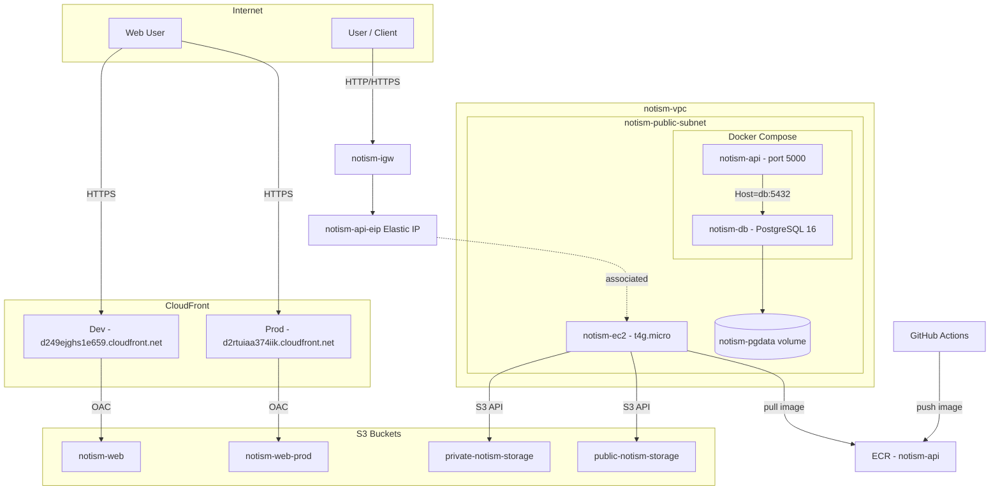
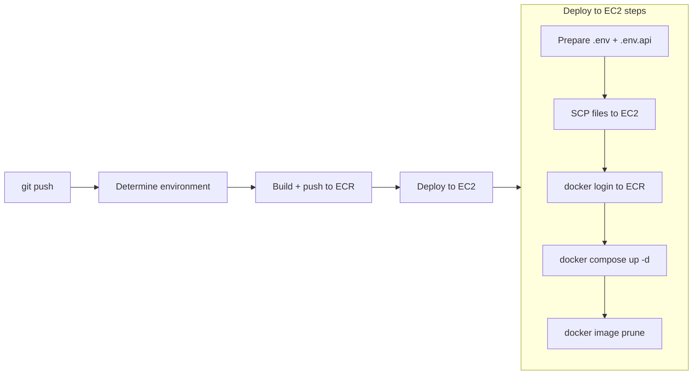

# Notism AWS infrastructure architecture

This document describes the AWS architecture used to run the Notism API. The API and PostgreSQL both run as Docker containers on a single EC2 instance, managed by Docker Compose. All AWS resources use the **notism** prefix and are provisioned via Terraform (`terraform/`).

---

## High-level diagram



---

## Components

| Layer | Component | Name / ID | Purpose |
|-------|-----------|-----------|---------|
| **Network** | VPC | notism-vpc | Isolated network (10.0.0.0/16). |
| | Internet Gateway | notism-igw | Connects VPC to the internet; used by the public subnet. |
| | Public subnet | notism-public-subnet | Hosts EC2; has route to IGW (0.0.0.0/0). AZ: us-east-1a. |
| | Private subnet A | notism-private-subnet-a | Available for future RDS. AZ: us-east-1a. |
| | Private subnet B | notism-private-subnet-b | Available for future RDS (2nd AZ). AZ: us-east-1b. |
| | Public route table | notism-public-rt | 0.0.0.0/0 -> IGW; associated with public subnet. |
| | Private route table | notism-private-rt | No IGW route; associated with both private subnets. |
| **Compute** | EC2 | notism-api (Name tag) | Runs Docker Compose with API + Postgres; t4g.micro, Amazon Linux 2023, Docker + Compose plugin. |
| | Elastic IP | notism-api-eip | Stable public IP for the API. |
| **Database** | PostgreSQL (Docker) | notism-db container | PostgreSQL 16 Alpine running as a Docker Compose service on EC2. Data persisted to `notism-pgdata` Docker volume. |
| **Security** | EC2 security group | notism-ec2-sg | Inbound: 22, 80, 443, 5000. Outbound: all. |
| **IAM** | Instance profile | notism-ec2-profile | Attached to EC2; allows S3 and ECR pull. |
| | Role | notism-ec2-role | Assumed by EC2; no long-lived keys in app config. |
| **Container registry** | ECR repository | notism-api | Stores Docker image for the API; CI pushes, EC2 pulls. |
| **Storage** | S3 bucket | private-notism-storage | Private file storage for the API (CORS, referer-based policy). |
| | S3 bucket | public-notism-storage | Public file storage (public-read policy). |
| | S3 bucket | notism-web | Dev frontend static hosting (served via CloudFront). |
| | S3 bucket | notism-web-prod | Prod frontend static hosting (served via CloudFront). |
| **CDN** | CloudFront distribution | E1GJTPGEDUM3ZO | Dev frontend CDN (origin: notism-web, OAC). |
| | CloudFront distribution | E3B3TRUPIAA1TW | Prod frontend CDN (origin: notism-web-prod, OAC). |
| | Origin Access Control | oac-notism-web | Allows CloudFront to read from notism-web bucket. |
| | Origin Access Control | oac-notism-web-prod | Allows CloudFront to read from notism-web-prod bucket. |

---

## Docker Compose deployment

The API and PostgreSQL run as sibling containers managed by Docker Compose on the EC2 instance.

### File layout on EC2

```
/opt/notism/
  docker-compose.yml   # service definitions (db + api)
  .env                 # compose-level variables (API_IMAGE, DB_PASSWORD)
  .env.api             # API app config (connection string, JWT, Resend, etc.)
```

### Services

| Service | Image | Container name | Purpose |
|---------|-------|---------------|---------|
| `db` | `postgres:16-alpine` | `notism-db` | PostgreSQL database. Data stored in `notism-pgdata` Docker volume. |
| `api` | ECR image (variable `${API_IMAGE}`) | `notism-api` | .NET 9 API. Reads config from `.env.api`. Connects to Postgres via Docker Compose DNS hostname `db`. |

### Connection string

The API connects to PostgreSQL using the Compose service name as the host:

```
Host=db;Database=notism_db;Username=notismadmin;Password=<DB_PASSWORD>;Port=5432
```

### Useful commands (on the EC2)

```bash
cd /opt/notism

sudo docker compose ps              # container status
sudo docker compose logs -f api     # follow API logs
sudo docker compose logs -f db      # follow Postgres logs
sudo docker compose restart api     # restart just the API
sudo docker compose down             # stop everything
sudo docker compose up -d            # start everything
```

---

## CI/CD pipeline

Deployment is triggered by pushes to `main` or `dev` via `.github/workflows/deploy.yml`.



### GitHub secrets and variables

| Name | Type | Purpose |
|------|------|---------|
| `AWS_ROLE_TO_ASSUME` | Secret | IAM role ARN for OIDC authentication. |
| `CONNECTION_STRING` | Secret | Npgsql connection string (`Host=db;...`). |
| `DB_PASSWORD` | Secret | PostgreSQL password for the Docker Compose `db` service. |
| `JWT_SECRET` | Secret | JWT signing key. |
| `RESEND_API_KEY` | Secret | Resend email API key. |
| `EC2_HOST` | Secret | EC2 public IP (Elastic IP). |
| `EC2_USER` | Secret | SSH user (typically `ec2-user`). |
| `EC2_SSH_PRIVATE_KEY` | Secret | PEM private key for SSH access. |
| `ECR_REPOSITORY` | Secret | ECR repository name (`notism-api`). |
| `CLIENT_APP_URL` | Variable | Frontend URL for CORS and email links. |
| `AWS_REGION` | Variable | AWS region (`us-east-1`). |

---

## Network design

### VPC and CIDR

- One VPC (10.0.0.0/16).
- Public subnet: 10.0.1.0/24.
- Private subnet A: 10.0.2.0/24 (us-east-1a).
- Private subnet B: 10.0.3.0/24 (us-east-1b).

### Public vs private subnets

- **Public subnet** has a route 0.0.0.0/0 to the Internet Gateway. EC2 gets a public IP (Elastic IP) and can be reached from the internet.
- **Private subnets** have no internet route. They are currently unused but reserved for future RDS if needed.

### Route tables

- **notism-public-rt**: default route 0.0.0.0/0 -> notism-igw; associated with notism-public-subnet.
- **notism-private-rt**: no internet route; associated with notism-private-subnet-a and notism-private-subnet-b.

---

## Security

### Security groups

- **notism-ec2-sg**: Allows SSH (22), HTTP (80), HTTPS (443), and API (5000) from 0.0.0.0/0. In production, restrict SSH to known IPs.
- **notism-rds-sg** (conditional): Only created when `use_rds = true`. Allows PostgreSQL (5432) from notism-ec2-sg only.

### IAM

- EC2 uses the **notism-ec2-profile** instance profile (role **notism-ec2-role**).
- The role has Amazon S3 full access and Amazon ECR read-only access so the app can use S3 buckets and pull images without storing access keys.

### Secrets

- Database password is passed to the Postgres container via the `DB_PASSWORD` GitHub secret, written to `.env` on EC2.
- App secrets (JWT, Resend, connection string) are written to `.env.api` on EC2 at deploy time. They never appear in the repo or Docker image.

---

## Data flow

1. **User -> API**: Internet -> IGW -> notism-public-subnet -> EC2 (port 5000) -> notism-api container.
2. **User -> Frontend**: Internet -> CloudFront -> S3 (notism-web or notism-web-prod via OAC).
3. **API -> PostgreSQL**: notism-api container -> Docker Compose network -> notism-db container (port 5432). Traffic stays within the EC2 instance.
4. **API -> S3**: EC2 -> IGW -> internet -> S3 (private-notism-storage / public-notism-storage via instance profile credentials).
5. **EC2 -> ECR**: EC2 pulls the API Docker image from ECR (using instance profile).
6. **CI -> ECR**: GitHub Actions builds the image and pushes to the notism-api ECR repository.

---

## RDS opt-in (switching back to managed database)

The Terraform code supports an optional managed RDS instance via the `use_rds` variable. Currently `use_rds = false` (PostgreSQL runs on EC2).

### To switch back to RDS

1. Set `use_rds = true` and provide `db_password` in terraform variables.
2. Run `terraform apply` to create the RDS instance, DB subnet group, and RDS security group.
3. Migrate data from EC2 Postgres to the new RDS instance.
4. Update the `CONNECTION_STRING` GitHub secret to point to the RDS hostname.
5. The `db` service in Docker Compose can be removed or left in place (API won't connect to it).

### Conditional Terraform resources (when `use_rds = true`)

| Resource | Name |
|----------|------|
| `aws_db_instance.main` | notism-db (PostgreSQL 16, db.t4g.micro) |
| `aws_db_subnet_group.main` | notism-db-subnet (spans both private subnets) |
| `aws_security_group.rds` | notism-rds-sg (port 5432 from EC2 SG) |

---

## Scalability and future changes

| Need | Change |
|------|--------|
| More API capacity | Add an ALB, register more EC2 instances, same AMI and IAM profile. |
| Managed database | Set `use_rds = true` in Terraform; migrate data from EC2 Postgres to RDS. |
| Larger database | If using RDS: resize instance class. If on EC2: increase EBS volume. |
| DB high availability | Switch to RDS with Multi-AZ (private subnets already span 2 AZs). |
| HTTPS / ALB | Put an ALB in front of EC2, attach ACM certificate. |
| Custom domain for frontend | Add an ACM certificate and CNAME alias to the CloudFront distributions. |

---

## Related docs

- [terraform-configuration.md](terraform-configuration.md) -- Terraform configuration reference.
- [../rules/architecture.md](../rules/architecture.md) -- Application architecture.
