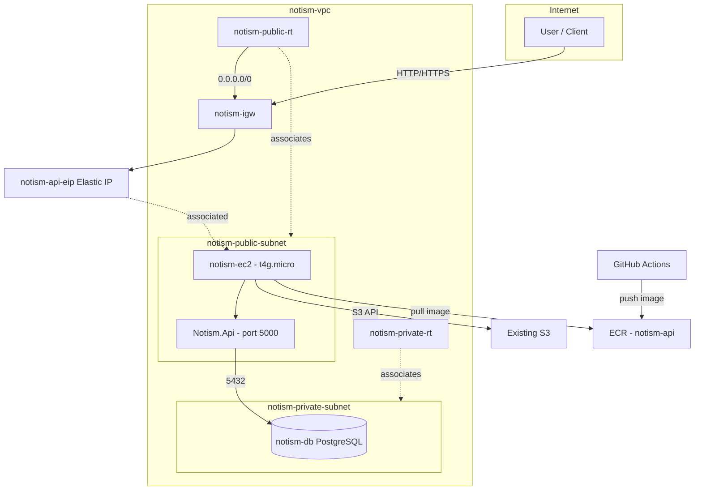

# Notism AWS infrastructure architecture

This document describes the AWS architecture used to run the Notism API on EC2 with PostgreSQL on RDS. All resources use the **notism** prefix. Deployment options: **Terraform** ([terraform/README.md](../terraform/README.md)) or **AWS CLI** ([deploy-aws-cli.md](deploy-aws-cli.md)).

---

## High-level diagram

---

## Components

| Layer | Component | Name / ID | Purpose |
|-------|-----------|-----------|---------|
| **Network** | VPC | notism-vpc | Isolated network (e.g. 10.0.0.0/16). |
| | Internet Gateway | notism-igw | Connects VPC to the internet; used by the public subnet. |
| | Public subnet | notism-public-subnet | Hosts EC2; has route to IGW (0.0.0.0/0). AZ: e.g. us-east-1a. |
| | Private subnet A | notism-private-subnet-a | Part of DB subnet group. AZ: e.g. us-east-1a. |
| | Private subnet B | notism-private-subnet-b | Second AZ for RDS requirement. AZ: e.g. us-east-1b. |
| | Public route table | notism-public-rt | 0.0.0.0/0 → IGW; associated with public subnet. |
| | Private route table | notism-private-rt | No IGW route; associated with both private subnets. |
| **Compute** | EC2 | notism-api (Name tag) | Runs Notism .NET 9 API; t4g.micro, Amazon Linux 2023. |
| | Elastic IP | notism-api-eip | Stable public IP for the API. |
| **Database** | RDS PostgreSQL | notism-db | Single-AZ, db.t4g.micro, database notism_db. |
| | DB subnet group | notism-db-subnet | Spans both private subnets (2 AZs required by RDS). |
| **Security** | EC2 security group | notism-ec2-sg | Inbound: 22, 80, 443, 5000. Outbound: all. |
| | RDS security group | notism-rds-sg | Inbound: 5432 from notism-ec2-sg only. |
| **IAM** | Instance profile | NotismEC2Profile | Attached to EC2; allows S3 and ECR pull. |
| | Role | NotismEC2Role | Assumed by EC2; no long-lived keys in app config. |
| **Container registry** | ECR repository | notism-api | Stores Docker image for the API; CI pushes, EC2 pulls. |
| **Storage** | S3 | (existing buckets) | App uses existing buckets via IAM instance profile. |

---

## Network design

### VPC and CIDR

- One VPC per environment (e.g. 10.0.0.0/16).
- Public subnet: 10.0.1.0/24.
- Private subnet A: 10.0.2.0/24 (us-east-1a).
- Private subnet B: 10.0.3.0/24 (us-east-1b).

### Public vs private subnets

- **Public subnet** has a route 0.0.0.0/0 to the Internet Gateway. EC2 gets a public IP (or Elastic IP) and can be reached from the internet and can reach the internet (S3, package managers, etc.).
- **Private subnets** use a route table with no route to the IGW. RDS has only private IPs and is not reachable from the internet; only resources in the VPC (e.g. EC2) can connect.

### Why two private subnets

RDS requires a DB subnet group to span **at least two Availability Zones**. We use two private subnets (notism-private-subnet-a and notism-private-subnet-b) to satisfy this. The instance runs in a single AZ (cost-saving); the second subnet is for the subnet group requirement and for future Multi-AZ if needed.

### Route tables

- **notism-public-rt**: default route 0.0.0.0/0 → notism-igw; associated with notism-public-subnet.
- **notism-private-rt**: no internet route; associated with notism-private-subnet-a and notism-private-subnet-b.

---

## Security

### Security groups

- **notism-ec2-sg**: Allows SSH (22), HTTP (80), HTTPS (443), and API (5000) from 0.0.0.0/0. In production, restrict SSH to known IPs.
- **notism-rds-sg**: Allows PostgreSQL (5432) only from notism-ec2-sg. No direct access from the internet.

### IAM

- EC2 uses the **NotismEC2Profile** instance profile (role **NotismEC2Role**).
- The role has Amazon S3 and Amazon ECR read access so the app can use existing S3 buckets and pull images without storing access keys.

### Secrets

- Database password and app secrets are not in the repo; they are set via environment variables or a secrets store on the EC2 instance.

---

## Data flow

1. **User → API**: Internet → IGW → notism-public-subnet → EC2 (ports 80/443/5000).
2. **API → RDS**: EC2 → notism-private-subnet (same VPC) → RDS on 5432 (allowed by notism-rds-sg).
3. **API → S3**: EC2 → IGW → internet → S3 (using instance profile credentials).
4. **EC2 → ECR**: EC2 pulls the API Docker image from ECR (using instance profile); used on deploy and container start.
5. **CI → ECR**: GitHub Actions (or other CI) builds the image and pushes to the notism-api ECR repository in the same region.
6. **Outbound from EC2**: Package managers, external APIs, etc. via IGW (public subnet).

---

## Scalability and future changes

The layout is kept cost-optimized but compatible with later scaling:

| Need | Change |
|------|--------|
| More API capacity | Add an ALB, register more EC2 instances in notism-ec2-sg, same AMI and IAM profile. |
| Larger database | Resize RDS: `modify-db-instance --db-instance-class db.t4g.small` (or larger). |
| More DB storage | Increase allocated storage or enable storage autoscaling. |
| DB high availability | Add second AZ to DB subnet group (already have 2 subnets), enable Multi-AZ. |
| Read-heavy DB | Add RDS read replicas; point read-only queries to replica endpoint in app. |
| HTTPS / ALB | Put an ALB in front of EC2, attach ACM certificate; optionally move EC2 to private subnet + NAT. |

The API is stateless (sessions in DB or external store) so horizontal scaling behind an ALB does not require app changes.

---

## Related docs

- [terraform-configuration.md](terraform-configuration.md) — Terraform configuration reference.
- [terraform/README.md](../terraform/README.md) — Quick start for Terraform.
- [deploy-aws-cli.md](deploy-aws-cli.md) — Deployment steps and CLI commands.
- [rules/architecture.md](rules/architecture.md) — Application architecture (if present).
